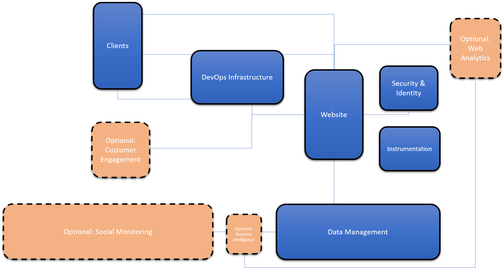
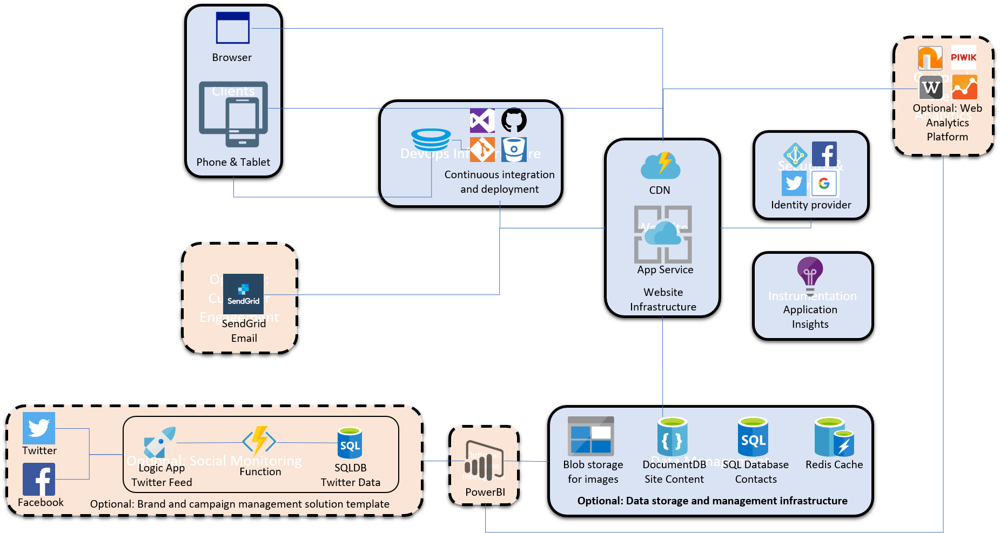

# Solution Architecture: Simple Digital Marketing Website

Your simple digital marketing website will be built from multiple Azure services, and you have some technology decisions to make and some considerations to be aware of.

First, regardless of the web framework you choose, you have to decide how you're going to host it: either using Paas (platform-as-a-service) or IaaS (infrastructure-as-a-service). Read about each of these hosting approaches in the "host your digital marketing website" node in the table of contents to the left. The documentation describes each approach and even include templates to deploy fully working architectures to Azure.

Next, you'll have to decide what web framework to use. This decision will influence which technologies you use to build your digital marketing website - what type of data storage, what type of data analytics, and what type of application lifecycle management. Read about each of these in the "create your digital marketing website" node in the table of contents to the left. 

Once you've created your website, decided how you'll manage the website's lifecycle, and started writing code you will want to make sure your website takes advantage of everything Azure has to offer. Azure provides the tools to make your website resilient, secure, and  automatically scale to meet customer demand. Read about how to accomplish this in the "take advantage of Azure strengths" node in the table of contents to the left.

## Next Steps

We've provided a complete sample digital marketing solution that includes code, deployment files, and application lifecycle management (DevOps) tools. You can either use this solution as it is or modify it to suit your needs. For more information, see *link*.

# Solution Architecture: Multi-channel Digital marketing platform for SMB with social integration and analytics

You can think about an architecture for your digital marketing solution in 2 ways. Either as a group of functional building blocks or as a set of services. 

## Functional Building blocks

Any Digital marketing solution consists of a set of building blocks that come together to make a complete solution. Some are required and some are optional. The diagram below looks at your Digital marketing infrastructure with this lens.

## Baseline Capabilities
Here is some starting out text before we get into a table

| Functional Area | Description|
|---------------- |:-----------|
| Website | At the heart of every digital marketing solution is web infrastructure that manages all of your content. |
|Clients| It is important to choose the appropriate client targets. Do you want a traditional website or just mobile solution. Do you choose a responsive website or build dedicated mobile clients?|
|Data Management| All of your marketing content is stored and managed in your data management infrastructure. This content can includes: text, images, audio and video. It may also include information like customer data.|
|Identity & Security| To provide an interactive customer experience it is often important to manage customer identity so that you can customer the experience that a customer has with your marketing platform. Also it is important to manage the security of your site to ensure that only authorized users can access your infrastructure to make updates |
|Instrumentation| In ordo ensure that your marketing platform operates optimally it is important to instrument all aspects so that you can track any issues and quickly deploy resolutions.|
|DevOps| In this age of cloud agility is more important than ever to have a development infrastructure to allow you to ship high quality software in an agile manner. A modern DevOps infrastructure allows you to manage your entire lifecycle. |

## Additional Capabilities
|Functional Area | Description |
|----------------|:-----------:|
|Analytics | 

## Azure Service Alignment

Any Digital marketing solution consists of a set of building blocks that come together to make a complete solution. Some are required and some are optional. The diagram below looks at your Digital marketing infrastructure with this lens.

## Baseline Capabilities
Here is some starting out text before we get into a table

| Functional Area | Service Alignment | Description|
|---------------- |:-------------|:-----------|
| Website | AppService | At the heart of every digital marketing solution is web infrastructure that manages all of your content. |
| | CDN | A content delivery network helps scale distribuiton of content for your website globally |
|Clients| | It is important to choose the appropriate client targets. Do you want a traditional website or just mobile solution. Do you choose a responsive website or build dedicated mobile clients?|
|Data Management| | All of your marketing content is stored and managed in your data management infrastructure. This content can includes: text, images, audio and video. It may also include information like customer data.|
|Identity & Security| |To provide an interactive customer experience it is often important to manage customer identity so that you can customer the experience that a customer has with your marketing platform. Also it is important to manage the security of your site to ensure that only authorized users can access your infrastructure to make updates |
|Instrumentation| | In ordo ensure that your marketing platform operates optimally it is important to instrument all aspects so that you can track any issues and quickly deploy resolutions.|
|DevOps| | In this age of cloud agility is more important than ever to have a development infrastructure to allow you to ship high quality software in an agile manner. A modern DevOps infrastructure allows you to manage your entire lifecycle. |

## Additional Capabilities
|Functional Area | Description |
|----------------|:-----------:|
|Analytics | 
