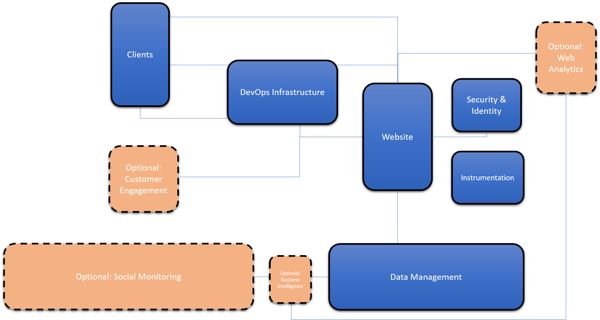

# Solution Architecture: Multi-channel Digital marketing platform for SMB with social integration and analytics

## Baseline Capabilities
Here is some starting out text before we get into a table

| Functional Area | Description|
|---------------- |:-------------|
| Website | At the heart of every digital marketing solution is web infrastructure that manages all of your content. |
|Clients| It is important to choose the appropriate client targets. Do you want a traditional website or just mobile solution. Do you choose a responsive website or build dedicated mobile clients?|
|Data Management| All of your marketing content is stored and managed in your data management infrastructure. This content can includes: text, images, audio and video. It may also include information like customer data.|
|Identity & Security| To provide an interactive customer experience it is often important to manage customer identity so that you can customer the experience that a customer has with your marketing platform. Also it is important to manage the security of your site to ensure that only authorized users can access your infrastructure to make updates |
|Instrumentation| In ordo ensure that your marketing platform operates optimally it is important to instrument all aspects so that you can track any issues and quickly deploy resolutions.|
|DevOps| In this age of cloud agility is more important than ever to have a development infrastructure to allow you to ship high quality software in an agile manner. A modern DevOps infrastructure allows you to manage your entire lifecycle. |

## Additional Capabilities
|Functional Area | Description |
|----------------|:-----------:|
|Analytics | 

## Next Steps

We've provided a complete sample digital marketing solution that includes code, deployment files, and application lifecycle management (DevOps) tools. You can either use this solution as it is or modify it to suit your needs. For more information, see *link*.

